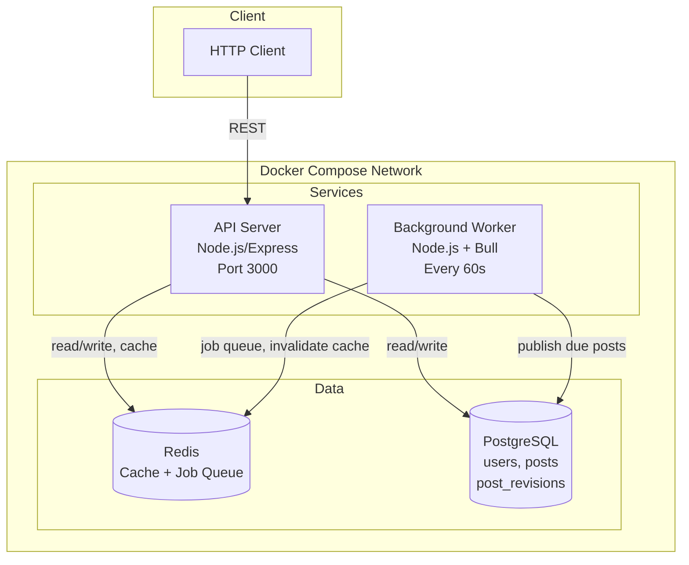

# Architecture

This document describes the architecture of the CMS Backend API: its components, how they interact, and key design choices.

## System Overview

The system is a **content management API** with JWT authentication, content versioning, scheduled publishing via a background worker, full-text search, and Redis caching. It is fully containerized and runs as four main components: **API server**, **worker**, **PostgreSQL**, and **Redis**.

## Architecture Diagram

### Mermaid (renders on GitHub/GitLab)



### ASCII

```
                    ┌─────────────────────────────────────────────────────────┐
                    │                     Client (HTTP)                       │
                    └───────────────────────────┬─────────────────────────────┘
                                                │
                                                ▼
┌───────────────────────────────────────────────────────────────────────────────────┐
│                              Docker Compose Network                                │
│                                                                                    │
│   ┌─────────────────────┐         ┌─────────────────────┐                         │
│   │      API Server     │         │  Background Worker  │                         │
│   │   (Node.js/Express) │         │  (Node.js + Bull)   │                         │
│   │   Port 3000         │         │                     │                         │
│   └──────────┬──────────┘         └──────────┬──────────┘                         │
│              │                               │                                     │
│              │  JWT auth, CRUD,               │  Every 60s:                        │
│              │  publish, schedule,            │  Publish due scheduled posts       │
│              │  revisions, media, search      │                                     │
│              │                               │                                     │
│              ▼                               ▼                                     │
│   ┌─────────────────────┐         ┌─────────────────────┐                         │
│   │       Redis         │◄───────►│    PostgreSQL       │                         │
│   │   Cache (published  │         │   users, posts,     │                         │
│   │   posts & lists)    │         │   post_revisions    │                         │
│   │   Job queue (Bull)  │         │   Full-text search  │                         │
│   └─────────────────────┘         └─────────────────────┘                         │
│                                                                                    │
└───────────────────────────────────────────────────────────────────────────────────┘
```

## Component Description

### 1. API Server

- **Technology:** Node.js, Express.
- **Role:** Serves all REST endpoints: authentication, post CRUD, lifecycle (publish/schedule), revisions, media upload, public read, and full-text search.
- **Behavior:**
  - Stateless; authentication via JWT in `Authorization: Bearer <token>`.
  - Author routes are protected by middleware that verifies JWT and ensures the user can only act on their own posts.
  - Reads/writes to PostgreSQL; uses Redis for caching published posts and list responses.
  - On startup, seeds a default author if none exists (no manual DB steps required).
- **Dependencies:** Waits for healthy `db` and `redis` before starting (Docker `depends_on` with healthchecks).

### 2. Background Worker

- **Technology:** Node.js, Bull (Redis-backed job queue).
- **Role:** Periodically finds posts with `status = 'scheduled'` and `scheduled_for <= NOW()`, and publishes them.
- **Behavior:**
  - Runs a repeatable job every 60 seconds.
  - For each due post, runs a **transaction**: set `status = 'published'`, `published_at = NOW()`.
  - **Idempotent:** Running twice for the same post does not cause errors or inconsistent state.
  - Invalidates Redis cache for the published list and for the affected post after each publish.
- **Dependencies:** Same PostgreSQL and Redis as the API; started after `db` and `redis` are healthy.

### 3. PostgreSQL (Database)

- **Role:** Persistent store for users, posts, and post revisions.
- **Schema:**
  - **users:** id, username, email (unique), password_hash, role (author | public).
  - **posts:** id, title, slug (unique), content, status (draft | scheduled | published), author_id, scheduled_for, published_at, timestamps, and `search_vector` (tsvector for full-text search).
  - **post_revisions:** id, post_id, title_snapshot, content_snapshot, revision_author_id, revision_timestamp.
- **Design choices:**
  - Indexes on foreign keys, `status`, `scheduled_for`, `published_at` for fast queries and worker performance.
  - GIN index on `search_vector` for full-text search on published content.
  - Trigger keeps `search_vector` in sync on insert/update.
- **Initialization:** Schema and indexes are applied automatically via `init.sql` in `docker-entrypoint-initdb.d` on first container start.

### 4. Redis

- **Role:**
  - **Cache:** Stores cached responses for “published post by ID” and “published posts list” (by page/limit). TTL 5 minutes for single post, 1 minute for list. Cache is invalidated when a published post is updated, deleted, or published.
  - **Job queue:** Bull uses Redis for the scheduled-publish job queue (repeatable job and worker process).
- **Resilience:** If Redis is unavailable, the API still works; cache calls are wrapped in try/catch and degrade to cache miss.

## Data Flow (Examples)

1. **Author creates and publishes a post:** Client → API (JWT) → PostgreSQL (insert post, then update status); API invalidates Redis list cache.
2. **Public reads published post:** Client → API → Redis (cache hit return) or PostgreSQL (cache miss, then cache set).
3. **Scheduled publish:** Worker (every 60s) → PostgreSQL (select due scheduled posts) → for each: transaction (update to published, set published_at) → Redis (invalidate list and post cache).
4. **Full-text search:** Client → API → PostgreSQL (query on `search_vector` for published posts only).

## Design Choices Summary

| Area | Choice | Rationale |
|------|--------|------------|
| **Auth** | JWT, stateless | No server-side session store; scales horizontally; token carries role and user id. |
| **Versioning** | Snapshot in `post_revisions` on every content/title update | Simple, auditable history with author and timestamp. |
| **Scheduling** | Bull + repeat job every 60s | Decoupled from API; fault-tolerant; uses existing Redis. |
| **Search** | PostgreSQL tsvector/GIN | No extra search engine; good performance for moderate scale. |
| **Caching** | Redis, cache-aside, invalidate on write | Reduces read load; invalidation keeps data consistent. |
| **Containers** | API and worker as separate services | Clear separation; worker can be scaled or restarted independently. |

## File Layout (Relevant to Architecture)

```
├── docker-compose.yml      # Defines api, worker, db, redis
├── Dockerfile             # API image
├── Dockerfile.worker      # Worker image
├── src/
│   ├── index.js           # Express app, routes, server (when run as main)
│   ├── config.js          # Env-based configuration
│   ├── db/
│   │   ├── pool.js        # PostgreSQL connection pool
│   │   ├── init.sql       # Schema, indexes, trigger (for DB init)
│   │   └── ensureSeed.js  # Default author on first run
│   ├── middleware/auth.js  # JWT verification, author-only, authorOwnsPost
│   ├── routes/            # auth, posts, public, search, media
│   ├── lib/redis.js       # Cache get/set/invalidate helpers
│   └── worker/
│       └── index.js       # Bull queue, processScheduledPublish loop
└── ...
```
